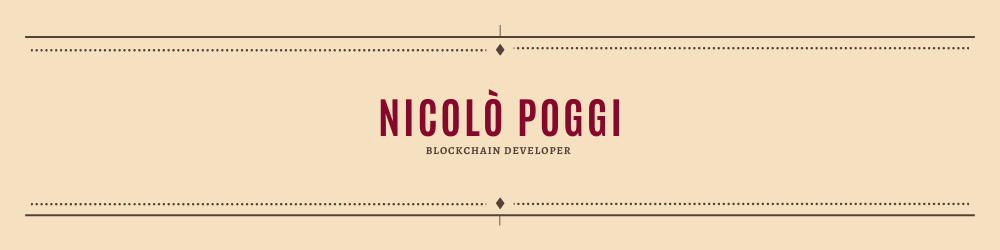

  

<h3 align="center">Hello world, I'm <a href="https://github.com/pogginicolo98">Nicolò</a> :wave:</h3>
<h2 align="center">I'm a Blockchain Developer :computer:, Bitcoin enthusiast :closed_lock_with_key: and video game lover :video_game:</h2>

I started studying my first programming languages at school and later I joined my first job as a PLC and SCADA developer.\
In June 2021, after more than 3 years, I decided to quit my job and start studying new programming languages and deepen the ones I already knew in order to change job and find one that I can really love.\
Here on my profile you can see the projects I have completed and the ones I am working on.

### :handshake: Connect with me:

* :speech_balloon: If you have any question/feedback, please do not hesitate to reach out to me!

 

## :closed_book: Here, some of my best personal projects
* [Echoes of the past](https://github.com/pogginicolo98/start2impact_solidity-project#readme) - Prototype of a fantasy themed NFT marketplace.
* [ChainBid](https://github.com/pogginicolo98/start2impact_final-project#readme) - Auction platform powered by Ethereum blockchain
* [SocialDex](https://github.com/pogginicolo98/start2impact_social-dex#readme) - Blockchain bulletin board

 

## :briefcase: Technical Skills
### Languages

### Frameworks & libraries

### Databases

### Platform & others

### Blockchains

 

## :bar_chart: GitHub Stats

  
  

<!---
pogginicolo98/pogginicolo98 is a ✨ special ✨ repository because its `README.md` (this file) appears on your GitHub profile.
You can click the Preview link to take a look at your changes.
--->
